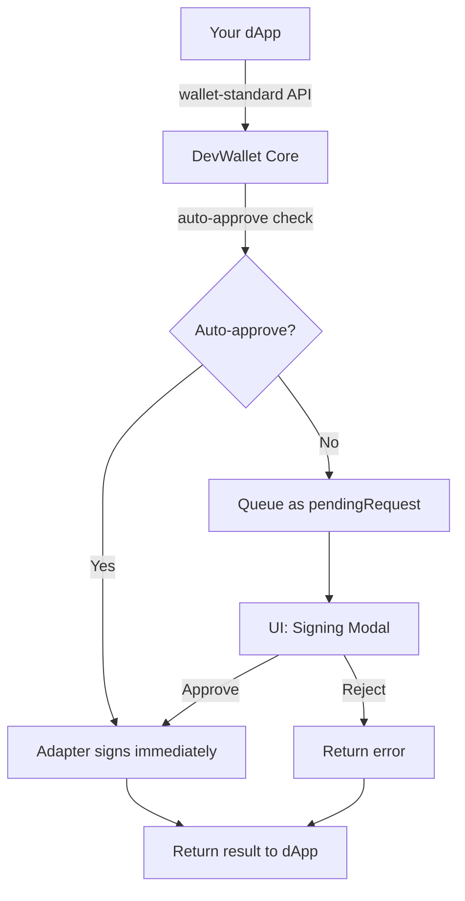
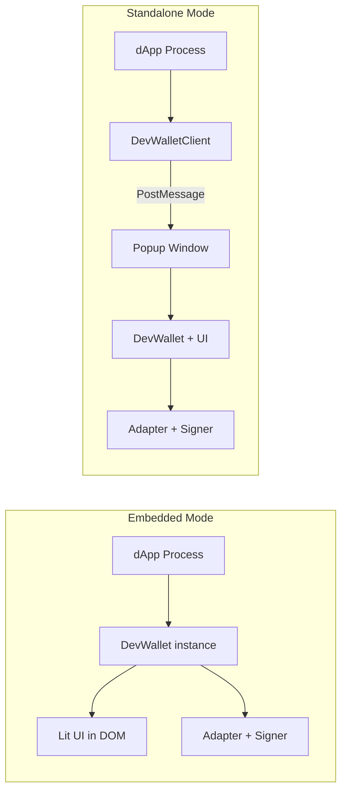

A deep dive into how Dev Wallet is designed and how the pieces fit together.

## System Overview

The request flow through Dev Wallet has three layers:

**Your dApp** — calls wallet-standard methods via dApp Kit or directly.

**DevWallet Core** — receives requests, checks auto-approve policy, either executes immediately or
queues for user approval. On approval, delegates to the adapter's signer. On rejection, returns an
error.

**Adapters** — each adapter manages keys differently (InMemory Ed25519, WebCrypto Secp256r1, Passkey
WebAuthn, Remote CLI over HTTP) but all implement the same `SignerAdapter` interface.

## Embedded vs Standalone

**Embedded mode** — the wallet runs in-process in your dApp. The `DevWallet` instance is created
directly, and the UI renders in your DOM. Best for development and testing.

**Standalone mode** — the wallet runs as a separate web app. Your dApp uses `DevWalletClient` to
communicate via popup windows and PostMessage. Supports CLI signing and team sharing.

## The Signing Pipeline

When a dApp calls `signTransaction`:

1. **DevWallet receives the request** via the wallet-standard `sui:signTransaction` feature
2. **Transaction is serialized** to JSON via `transaction.toJSON()`
3. **Auto-approve check** — evaluates the `autoApprove` policy and the adapter's `allowAutoSign`
4. **Queue or execute:**
   - Auto-approved: immediately calls the adapter's signer
   - Manual: stores the request as `pendingRequest` and notifies listeners
5. **UI renders the signing modal** — shows transaction details, approve/reject buttons
6. **User action:**
   - Approve: `wallet.approveRequest()` → adapter signs → promise resolves
   - Reject: `wallet.rejectRequest()` → promise rejects with error
7. **Result returned** to the dApp

## Export Map Architecture

The package is split into subpath exports to support different environments:

| Export                        | Contains                                                   |
| ----------------------------- | ---------------------------------------------------------- |
| `@mysten/dev-wallet`          | Core `DevWallet` class, types                              |
| `@mysten/dev-wallet/adapters` | InMemory, WebCrypto, Passkey, RemoteCli, BaseSignerAdapter |
| `@mysten/dev-wallet/ui`       | Lit Web Components, `mountDevWallet`                       |
| `@mysten/dev-wallet/react`    | React hooks, context, component wrappers                   |
| `@mysten/dev-wallet/client`   | `DevWalletClient` for standalone mode                      |
| `@mysten/dev-wallet/server`   | Request handling, CLI signing middleware                   |

## Wallet-Standard Compliance

Dev Wallet implements the full wallet-standard interface:

| Feature                         | Version | Description                                    |
| ------------------------------- | ------- | ---------------------------------------------- |
| `standard:connect`              | 1.0.0   | Connect with account selection or auto-connect |
| `standard:disconnect`           | 1.0.0   | Disconnect and clear accounts                  |
| `standard:events`               | 1.0.0   | Subscribe to account and network changes       |
| `sui:signTransaction`           | 2.0.0   | Sign a transaction without executing           |
| `sui:signAndExecuteTransaction` | 2.0.0   | Sign and execute a transaction                 |
| `sui:signPersonalMessage`       | 1.1.0   | Sign an arbitrary message                      |

## Key Design Decisions

**One request at a time** — prevents confusion. The user always reviews exactly one transaction.
DApps that batch transactions should serialize their signing calls.

**Adapter aggregation** — DevWallet unions accounts from all adapters. This lets you use InMemory
for quick throwaway accounts alongside WebCrypto for persistent ones.

**Shadow DOM UI** — Lit components render in Shadow DOM, isolating styles from your app. The wallet
panel never breaks your layout or inherits your CSS.

**Listener pattern** — `onRequestChange()` and `onConnectChange()` return unsubscribe functions,
following the same pattern as wallet-standard events.
