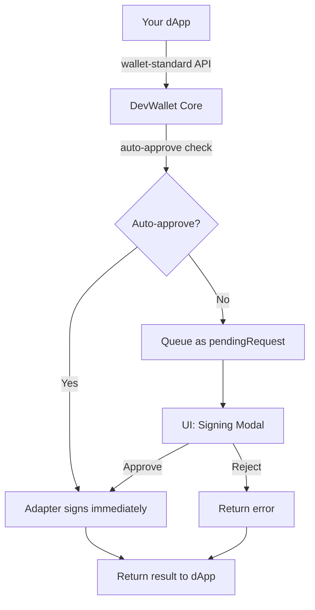
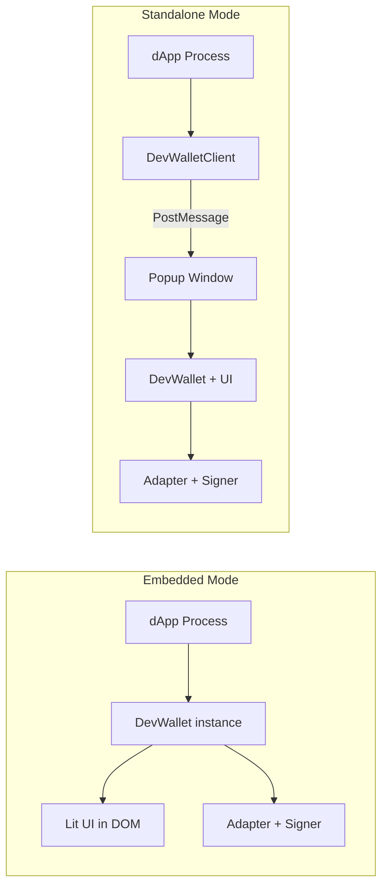

## System Overview

The request flow through Dev Wallet has three layers:

**Your dApp** — calls wallet-standard methods via dApp Kit or directly.

**DevWallet Core** — checks auto-approve policy, executes immediately or queues for user approval.

**Adapters** — InMemory (Ed25519), WebCrypto (Secp256r1), Passkey (WebAuthn), and Remote CLI (HTTP)
all implement the same `SignerAdapter` interface.

## Embedded vs Standalone

**Embedded mode** — the wallet runs in-process in your dApp. The `DevWallet` instance is created
directly, and the UI renders in your DOM. Best for development and testing.

**Standalone mode** — the wallet runs as a separate web app. Your dApp uses `DevWalletClient` to
communicate via popup windows and PostMessage. Supports CLI signing and team sharing.

## The Signing Pipeline

When a dApp calls `signTransaction`:

1. Transaction is serialized to JSON via `transaction.toJSON()`
2. Auto-approve check: adapter's `allowAutoSign` is evaluated first (adapters can opt out regardless
   of wallet policy), then the wallet-level `autoApprove` policy
3. Auto-approved: calls the adapter's signer directly, returns the result
4. Manual: stored as `pendingRequest`, listeners notified, UI shows the modal
5. `approveRequest()` → adapter signs → promise resolves; `rejectRequest()` → promise rejects

## Export Map Architecture

The package is split into subpath exports to support different environments:

| Export                        | Contains                                                              |
| ----------------------------- | --------------------------------------------------------------------- |
| `@mysten/dev-wallet`          | Core `DevWallet` class, types                                         |
| `@mysten/dev-wallet/adapters` | InMemory, WebCrypto, Passkey, RemoteCli, BaseSignerAdapter            |
| `@mysten/dev-wallet/ui`       | Lit Web Components, `mountDevWallet`                                  |
| `@mysten/dev-wallet/react`    | React hooks, context, component wrappers                              |
| `@mysten/dev-wallet/client`   | `DevWalletClient`, `devWalletClientInitializer`, `parseWalletRequest` |
| `@mysten/dev-wallet/server`   | `createCliSigningMiddleware` (Hono sub-app for CLI signing)           |

## Wallet-Standard Compliance

Dev Wallet implements the full wallet-standard interface:

| Feature                         | Version | Description                                    |
| ------------------------------- | ------- | ---------------------------------------------- |
| `standard:connect`              | 1.0.0   | Connect with account selection or auto-connect |
| `standard:disconnect`           | 1.0.0   | Ends the dApp session; wallet state unchanged  |
| `standard:events`               | 1.0.0   | Subscribe to account and network changes       |
| `sui:signTransaction`           | 2.0.0   | Sign a transaction without executing           |
| `sui:signAndExecuteTransaction` | 2.0.0   | Sign and execute a transaction                 |
| `sui:signPersonalMessage`       | 1.1.0   | Sign an arbitrary message                      |

## Key Design Decisions

**One request at a time** — prevents confusion. The user always reviews exactly one transaction.
DApps that batch transactions should serialize their signing calls.

**Adapter aggregation** — DevWallet unions accounts from all adapters. This lets you use InMemory
for quick throwaway accounts alongside WebCrypto for persistent ones.

**Shadow DOM UI** — Lit components render in Shadow DOM, isolating styles from your app. The wallet
panel never breaks your layout or inherits your CSS.

**Listener pattern** — `onRequestChange()` and `onConnectChange()` return unsubscribe functions,
following the same pattern as wallet-standard events.
