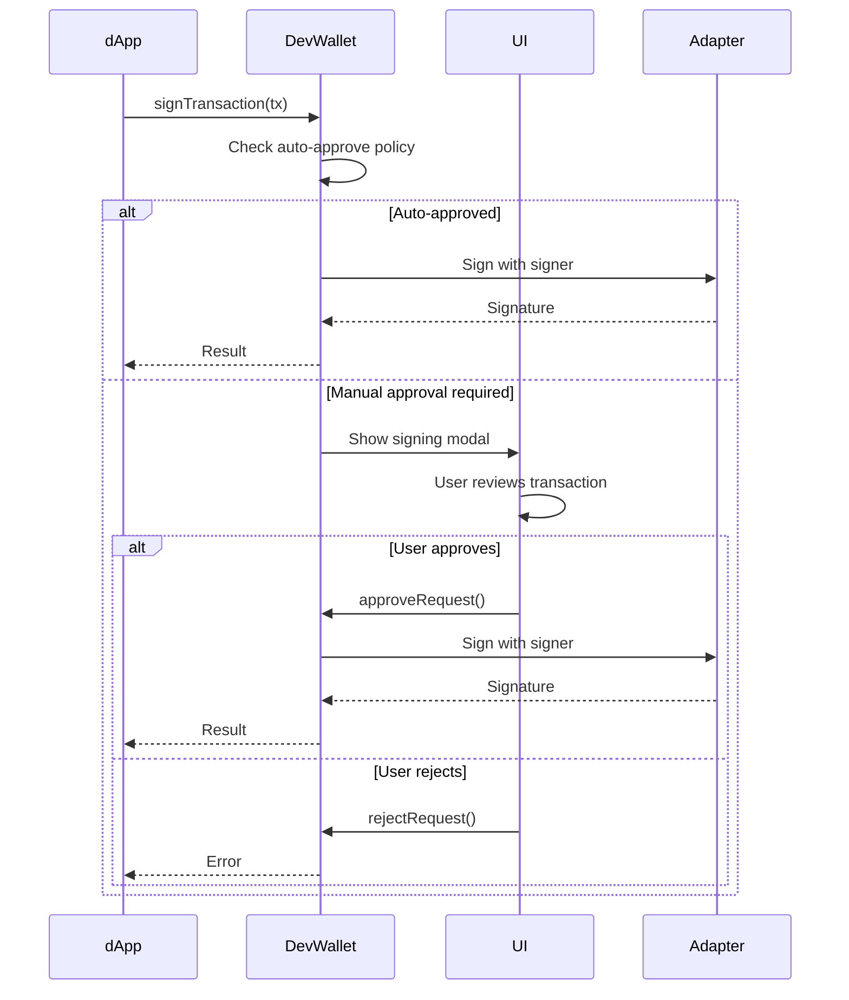

import { SigningFlowDemo } from '../../../examples/dev-wallet-demos-client';

Dev Wallet uses a request queue to ensure every signing operation is explicitly approved — just like
a real wallet.

## How It Works

When a dApp calls a signing method, the request flows through the wallet:



## One Request at a Time

The wallet processes one signing request at a time. If a second request arrives while one is
pending, it's immediately rejected with `"A signing request is already pending."` This prevents
confusion and ensures the user is always reviewing exactly one transaction.

<Callout type="info">
	dApps that send multiple transactions should serialize their signing calls — `await` each one
	before sending the next.
</Callout>

## Request Types

| Type                           | Triggered By                    | Data                       |
| ------------------------------ | ------------------------------- | -------------------------- |
| `sign-transaction`             | `sui:signTransaction`           | Transaction JSON string    |
| `sign-and-execute-transaction` | `sui:signAndExecuteTransaction` | Transaction JSON string    |
| `sign-personal-message`        | `sui:signPersonalMessage`       | `Uint8Array` message bytes |

## The Signing Modal

When a signing request arrives, the wallet displays a modal with request details, the account being
asked to sign, and Approve/Reject buttons:


## Try It

Click the button to trigger a signing request, then open the wallet panel to approve or reject it:

<SigningFlowDemo />

## Programmatic Approval

You can approve or reject requests without the UI — useful for testing:

```typescript
// Enqueue a request (returns a Promise)
const resultPromise = wallet.features['sui:signPersonalMessage'].signPersonalMessage({
	message: new TextEncoder().encode('Hello'),
	account: wallet.accounts[0],
});

// Check the pending request
console.log(wallet.pendingRequest);
// { id: '...', type: 'sign-personal-message', account: ..., data: Uint8Array }

// Approve it
await wallet.approveRequest();

// The promise resolves
const result = await resultPromise;
console.log(result.signature);
```

### Rejecting a Request

```typescript
wallet.rejectRequest('User declined');
// The promise rejects with Error('User declined')
```

## Subscribing to Request Changes

```typescript
const unsubscribe = wallet.onRequestChange((request) => {
	if (request) {
		console.log('New request:', request.type, request.id);
	} else {
		console.log('Request resolved');
	}
});

// Later: unsubscribe()
```

## Connect Approval

Connect requests follow the same pattern. When a dApp calls `standard:connect`, the wallet can
either auto-connect (with `autoConnect: true`) or queue a connect request for the user to select
which accounts to expose:


```typescript
// Subscribe to connect requests
wallet.onConnectChange((request) => {
	if (request) {
		// Show account picker
	}
});

// Approve with selected addresses
wallet.approveConnect(['0xabc...', '0xdef...']);

// Or reject
wallet.rejectConnect('User cancelled');
```

## Transaction Analysis

The signing modal automatically analyzes transaction commands and displays:

- **MoveCall** — package, module, function, and arguments
- **TransferObjects** — recipient address and objects being transferred
- **SplitCoins** — coin type and split amounts
- **MergeCoins** — coins being merged

This helps developers understand exactly what each transaction does before approving.
