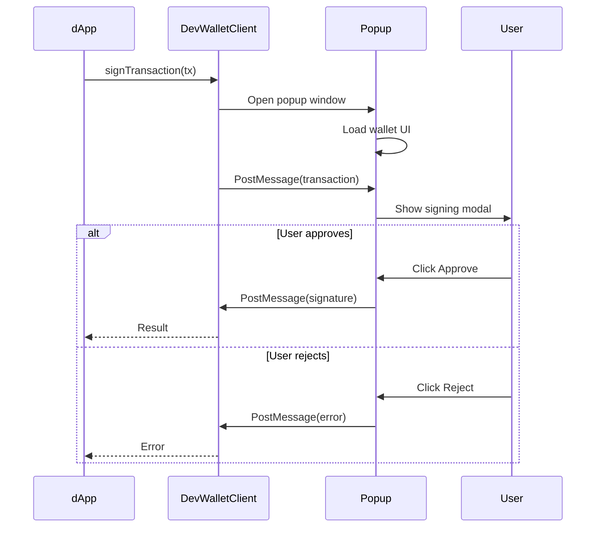

Run Dev Wallet as a separate web application. Your dApp communicates with it via popup windows and
PostMessage.

## Starting the Server

```bash
npx @mysten/dev-wallet serve
```

This starts a Vite dev server (default port 5174) with:

- WebCrypto and InMemory adapters enabled
- Remote CLI adapter enabled if `sui` is on your PATH
- Full wallet UI at `http://localhost:5174`
- PostMessage handling for popup-based signing

### Options

```bash
npx @mysten/dev-wallet serve --port 3000
```

## Connecting from a dApp

### Via walletInitializers (recommended)

If your dApp uses `@mysten/dapp-kit-react`, register the standalone wallet through
`walletInitializers`:

```typescript
import { createDAppKit } from '@mysten/dapp-kit-react';
import { devWalletClientInitializer } from '@mysten/dev-wallet/client';

const dAppKit = createDAppKit({
	networks: ['devnet'],
	walletInitializers: [devWalletClientInitializer({ origin: 'http://localhost:5174' })],
});
```

### Via direct registration

If you're not using dApp Kit, register the wallet client directly:

```typescript
import { DevWalletClient } from '@mysten/dev-wallet/client';

const unregister = DevWalletClient.register({
	origin: 'http://localhost:5174',
});
```

### Via bookmarklet (no code changes)

If you can't modify the dApp source, use the bookmarklet to inject the wallet into any page. The
standalone server serves a script at `/bookmarklet.js` that registers the wallet via the
wallet-standard window event protocol.

Drag the bookmarklet link from the wallet's Settings tab into your browser bookmarks bar, or paste
this in your browser console:

```javascript
var s = document.createElement('script');
s.src = 'http://localhost:5174/bookmarklet.js';
document.head.appendChild(s);
```

The bookmarklet automatically detects the wallet server origin from the script URL.

## How Popup Signing Works



## API

### devWalletClientInitializer

Returns a wallet initializer object for use with `createDAppKit({ walletInitializers: [...] })`:

```typescript
function devWalletClientInitializer(options?: DevWalletClientOptions): {
	id: string;
	initialize(): { unregister: () => void };
};
```

### DevWalletClient

For direct registration without dApp Kit:

```typescript
class DevWalletClient implements Wallet {
	constructor(options?: DevWalletClientOptions);
	static register(options?: DevWalletClientOptions): () => void;
}
```

### Options

| Option   | Type         | Default                   | Description                     |
| -------- | ------------ | ------------------------- | ------------------------------- |
| `name`   | `string`     | `'Dev Wallet (Web)'`      | Display name in wallet picker   |
| `icon`   | `WalletIcon` | Built-in icon             | Wallet icon                     |
| `origin` | `string`     | `'http://localhost:5174'` | Origin of the standalone wallet |

## CLI Signer

When `sui` is detected on your PATH, the standalone server enables the Remote CLI adapter
automatically. This means you can use your real keystore accounts (`~/.sui/sui_config/sui.keystore`)
for signing.

The CLI adapter supports all key schemes available in your keystore (Ed25519, Secp256k1, Secp256r1).

## Session Management

The standalone wallet uses JWT-based sessions:

1. On `connect()`, a popup opens and the user selects accounts
2. The wallet creates a JWT session token containing the selected account addresses
3. The token is stored in `localStorage` and reused for subsequent signing requests
4. On `disconnect()`, the session is cleared

## Multiple dApps

Because the standalone wallet runs independently, any number of dApps can connect to the same
instance. Each dApp gets its own JWT session scoped to its origin, but all sessions share the same
underlying accounts and balances. Useful when working across several dApps simultaneously, sharing
dev accounts with a team, or when you can't modify a dApp's source to embed a wallet.

## Embedded vs Standalone

|                 | Embedded                     | Standalone                     |
| --------------- | ---------------------------- | ------------------------------ |
| **Setup**       | `useDevWallet()` in your app | `npx @mysten/dev-wallet serve` |
| **Import**      | `@mysten/dev-wallet/react`   | `@mysten/dev-wallet/client`    |
| **UI Location** | In your app's DOM            | Separate popup windows         |
| **Signing**     | In-process, same origin      | Cross-origin via PostMessage   |
| **CLI Keys**    | Not available                | Available if `sui` on PATH     |
| **Best For**    | Development, testing         | Teams sharing a wallet server  |
